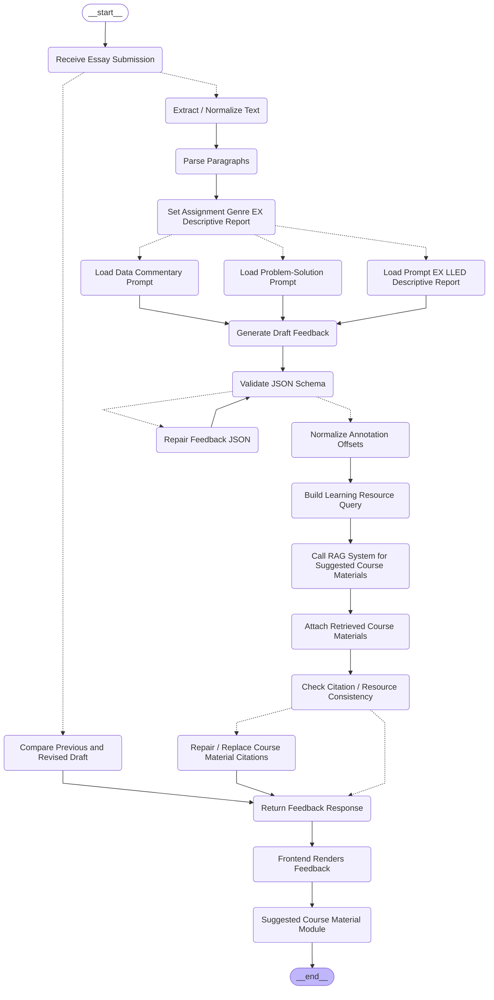

# Assignment Feedback Graph

Generated with LangGraph `getGraph().drawMermaid()`.

```mermaid
%%{init: {'flowchart': {'curve': 'linear'}}}%%
graph TD;
	__start__([<p>__start__</p>]):::first
	Receive_Essay_Submission(Receive Essay Submission)
	Extract___Normalize_Text(Extract / Normalize Text)
	Parse_Paragraphs(Parse Paragraphs)
	Set_Assignment_Genre_EX_Descriptive_Report(Set Assignment Genre EX Descriptive Report)
	Load_Prompt_EX_LLED_Descriptive_Report(Load Prompt EX LLED Descriptive Report)
	Load_Data_Commentary_Prompt(Load Data Commentary Prompt)
	Load_Problem-Solution_Prompt(Load Problem-Solution Prompt)
	Generate_Draft_Feedback(Generate Draft Feedback)
	Validate_JSON_Schema(Validate JSON Schema)
	Normalize_Annotation_Offsets(Normalize Annotation Offsets)
	Repair_Feedback_JSON(Repair Feedback JSON)
	Build_Learning_Resource_Query(Build Learning Resource Query)
	Call_RAG_System_for_Suggested_Course_Materials(Call RAG System for Suggested Course Materials)
	Attach_Retrieved_Course_Materials(Attach Retrieved Course Materials)
	Check_Citation___Resource_Consistency(Check Citation / Resource Consistency)
	Return_Feedback_Response(Return Feedback Response)
	Repair___Replace_Course_Material_Citations(Repair / Replace Course Material Citations)
	Frontend_Renders_Feedback(Frontend Renders Feedback)
	Suggested_Course_Material_Module(Suggested Course Material Module)
	Compare_Previous_and_Revised_Draft(Compare Previous and Revised Draft)
	__end__([<p>__end__</p>]):::last
	Attach_Retrieved_Course_Materials --> Check_Citation___Resource_Consistency;
	Build_Learning_Resource_Query --> Call_RAG_System_for_Suggested_Course_Materials;
	Call_RAG_System_for_Suggested_Course_Materials --> Attach_Retrieved_Course_Materials;
	Compare_Previous_and_Revised_Draft --> Return_Feedback_Response;
	Extract___Normalize_Text --> Parse_Paragraphs;
	Frontend_Renders_Feedback --> Suggested_Course_Material_Module;
	Generate_Draft_Feedback --> Validate_JSON_Schema;
	Load_Data_Commentary_Prompt --> Generate_Draft_Feedback;
	Load_Problem-Solution_Prompt --> Generate_Draft_Feedback;
	Load_Prompt_EX_LLED_Descriptive_Report --> Generate_Draft_Feedback;
	Normalize_Annotation_Offsets --> Build_Learning_Resource_Query;
	Parse_Paragraphs --> Set_Assignment_Genre_EX_Descriptive_Report;
	Repair___Replace_Course_Material_Citations --> Return_Feedback_Response;
	Repair_Feedback_JSON --> Validate_JSON_Schema;
	Return_Feedback_Response --> Frontend_Renders_Feedback;
	Suggested_Course_Material_Module --> __end__;
	__start__ --> Receive_Essay_Submission;
	Receive_Essay_Submission -.-> Extract___Normalize_Text;
	Receive_Essay_Submission -.-> Compare_Previous_and_Revised_Draft;
	Set_Assignment_Genre_EX_Descriptive_Report -.-> Load_Prompt_EX_LLED_Descriptive_Report;
	Set_Assignment_Genre_EX_Descriptive_Report -.-> Load_Data_Commentary_Prompt;
	Set_Assignment_Genre_EX_Descriptive_Report -.-> Load_Problem-Solution_Prompt;
	Validate_JSON_Schema -.-> Normalize_Annotation_Offsets;
	Validate_JSON_Schema -.-> Repair_Feedback_JSON;
	Check_Citation___Resource_Consistency -.-> Return_Feedback_Response;
	Check_Citation___Resource_Consistency -.-> Repair___Replace_Course_Material_Citations;
	classDef default fill:#f2f0ff,line-height:1.2;
	classDef first fill-opacity:0;
	classDef last fill:#bfb6fc;
```
