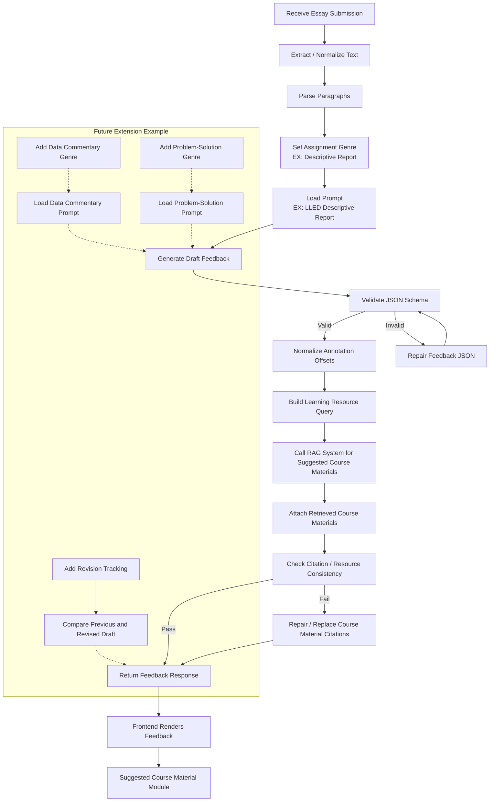

# Assignment Feedback Graph with RAG Suggested Course Materials

```mermaid
flowchart TD
  A[Receive Essay Submission] --> B[Extract / Normalize Text]
  B --> C[Parse Paragraphs]
  C --> D[Set Assignment Genre<br/>EX: Descriptive Report]

  D --> E[Load Prompt<br/>EX: LLED Descriptive Report]
  E --> F[Generate Draft Feedback]

  F --> G[Validate JSON Schema]
  G -->|Valid| H[Normalize Annotation Offsets]
  G -->|Invalid| I[Repair Feedback JSON]
  I --> G

  H --> J[Build Learning Resource Query]
  J --> K[Call RAG System for Suggested Course Materials]
  K --> L[Attach Retrieved Course Materials]
  L --> M[Check Citation / Resource Consistency]

  M -->|Pass| N[Return Feedback Response]
  M -->|Fail| O[Repair / Replace Course Material Citations]
  O --> N

  N --> P[Frontend Renders Feedback]
  P --> Q[Suggested Course Material Module]

  subgraph Future Extension Example
    R[Add Data Commentary Genre] -.-> S[Load Data Commentary Prompt]
    S -.-> F
    T[Add Problem-Solution Genre] -.-> U[Load Problem-Solution Prompt]
    U -.-> F
    V[Add Revision Tracking] -.-> W[Compare Previous and Revised Draft]
    W -.-> N
  end
```
